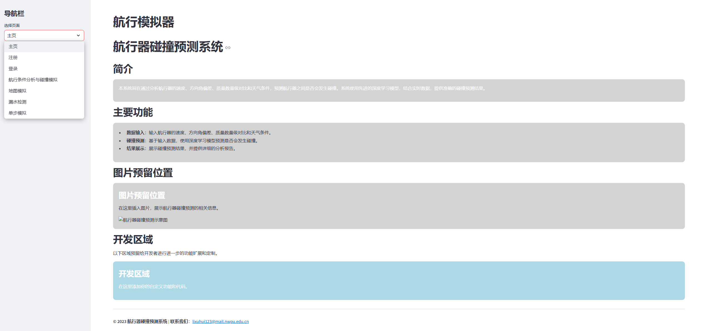
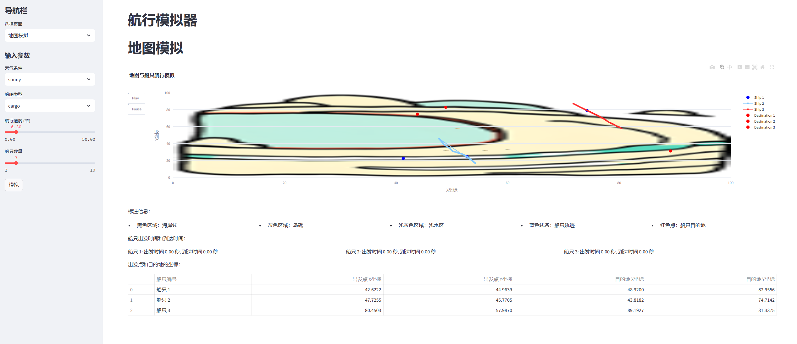
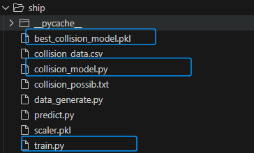
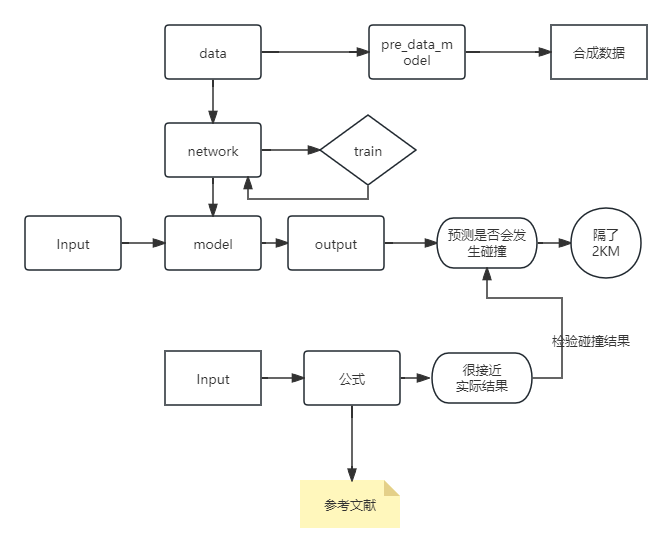
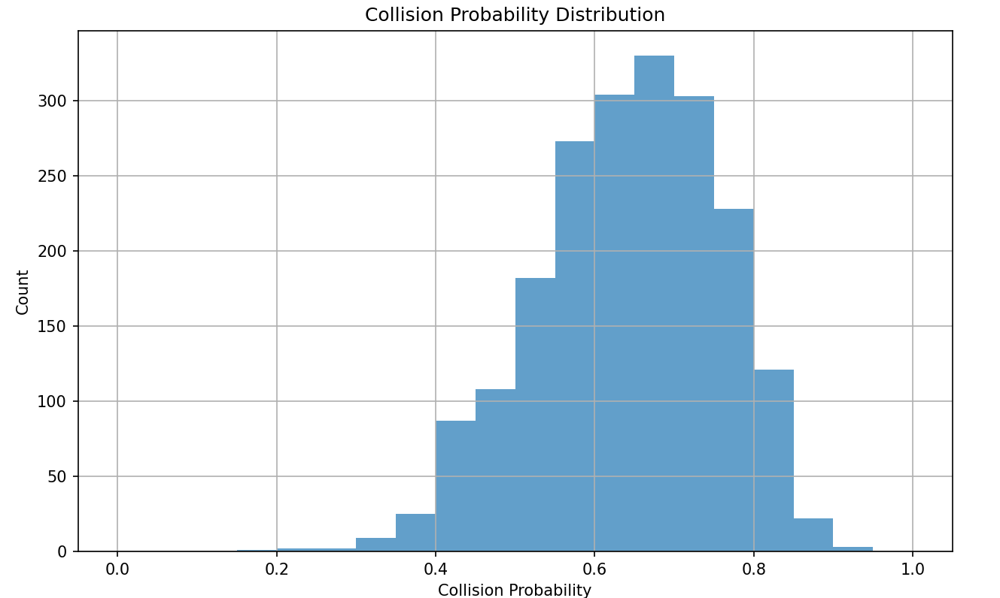
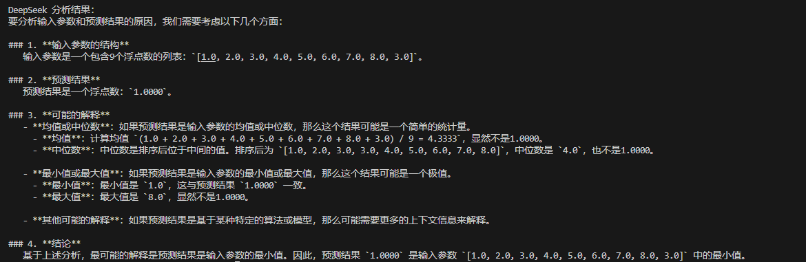
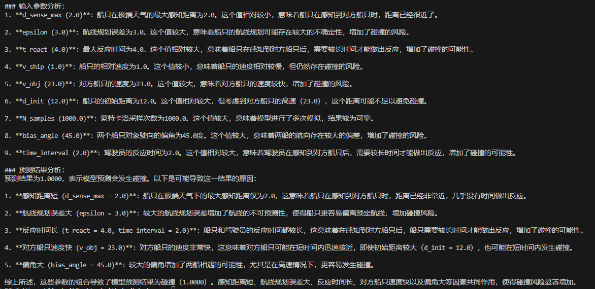

### 简单描述下当前的 Highlights and Weakness

#### Highlight

###### 1.具有一个成型的，可部署，能使用，便于开发的软件界面，如下

我觉得起码不算丑，能用，起码能给科普的人用，可以部署，注册收费盈利模式

###### 2.一个相对功能多的界面：

这里面点是可以动态移动的，分析的数据比较多

###### 3.能train一个model,并且model可以使用，对模型的合成数据函数是进行过精心设计 我们知道workflow 可以优化

理论上训练的数据量可以无限多，但是这里只训练了1w条

这里可以近似我们训练的piepline,还是有点复杂的
比较均匀的合成数据思路

###### 4 理论上设计的物理模型的算法还是有 数学和物理的含金量的
包括多边形点阵的变换（可能算的不太对，可以优化）
将变速曲线运动规划为抛物线求最近点
采用蒙特卡洛估算 重叠面积计算损失程度

没有技术含量的：
对不同的天气进行标注估算预测距离 理论指标函数
船只的质量对比测算 （可以优化）

### 画饼的
#### 1.毕设
我的毕设做的是医学图像转文本，可以迁移成文本数据为碰撞事故的描述和分析，图片改为碰撞前的某些场景和参数
2.大语言模型接口： deepseek
我买了API，之前给自己写的小程序使用过的，效果还不错，给一个prompt就行，当然这一点可以加花 这里的API只能说能用但是并不好

这是修改prompt后的版本

这是增加基础UI后的场景
3.AI小程序很有前景，投资给航海业务

### weakness
1.目前数据都是合成的，真实数据获取真的很难，而且基本不准，别个公司很难给我们公开这些数据
2.模型只能说跑通了，但是没有和其他模型对比，也没有竞品分析
3.前面做的三航元宇宙感觉关联性不大，只能说后端设计有关系，得想办法扯上联系
4.团队都是本科生，不硬核
5.导师不行
6.没有与公司合作
7.资金真的真的很少
