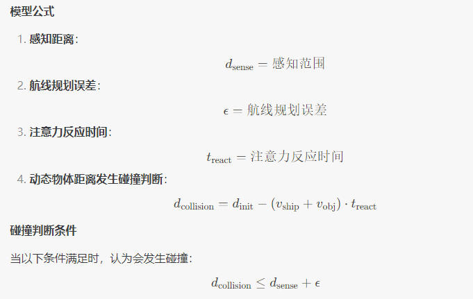
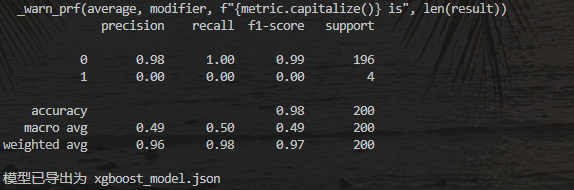
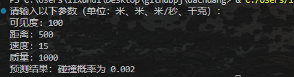
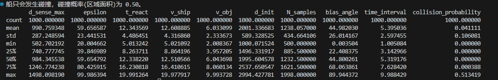
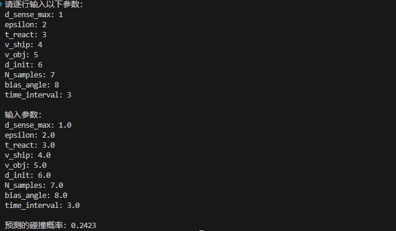
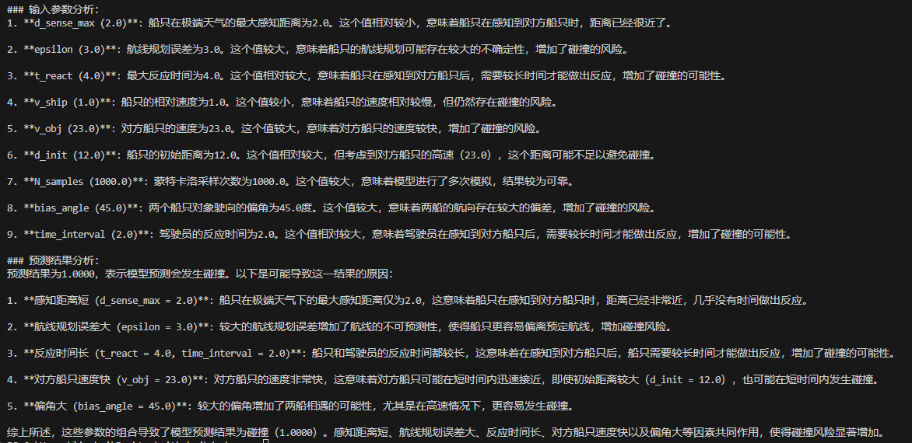
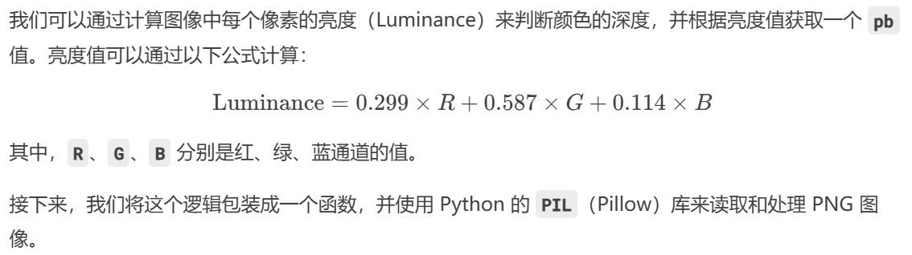
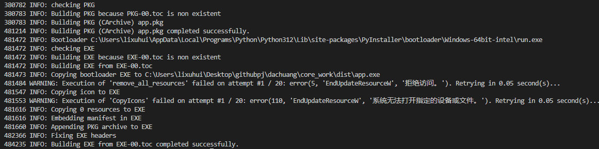

pip install streamlit pandas numpy matplotlib plotly

streamlit run app.py

// 绝对路径
streamlit run c:/Users/18241/Desktop/myproject/core_work/app.py

-i https://pypi.tuna.tsinghua.edu.cn/simple

URL:
            You can now view your Streamlit app in your browser.

            Local URL: http://localhost:8501
            Network URL: http://192.168.18.193:8501

streamlit sharing: 
    https://share.streamlit.io/

pip install pipreqs
pipreqs .

url: 
    https://dachuang2025shanxi.streamlit.app

AI图片生成：
    https://www.canva.cn/image-generator/?utm_medium=paid&utm_source=baidu&utm_campaign=ACQ-magic-tti&utm_term=aitupianshengchengmianfei&utm_content=sem&bd_vid=12592528579345434432

github仓库
    https://github.com/l1x2h3/dachuang/tree/main

数据处理阶段：网上搜集与构造数据，其实上千1000个构造就没事了
1.需要如下数据集：船只的结构点阵图 --- 只是为了画图，让UI界面更好看
2.故障参数数据，是否发生事故
3.船只运行实际情况图，抓取真是数据（看看网上有没有现成的），只能让AI工具不断改，模拟多对象情况下发生碰撞的情况；

方法1： 合成数据，用AI给出python代码生成随机数或者符合特定分布
方法2：真实数据，但是我们这个小项目成本太高，除非想去发论文？

tips： 可以尝试python脚本写爬虫

要求： 写清楚数据单位，类型，name，抓之前最好和我们模型保持一致
数据存放到data文件夹里面，到时候要写脚本跑模型的

1.船体建模数据：
https://patents.google.com/patent/CN105447909A/zh
https://www.marinetraffic.com/en/ais/home/shipid:5419524/zoom:10

感觉目前找不到合适的数据，这里选择合成数据：

下面是关于碰撞的重新建模：

这里的感知距离和天气有关，请你根据参考文献重新做判断选择，同时给他其他数据的参考文献来源，最后判断标准改成从俯视图角度，在一个船的俯视图中随机多次采样，如果点在另一个图形范围内，则证明发生了碰撞

根据天气给出了概率系数，分类反馈
传入的数据作为多边形来处理，调整接口即可；现在应该封装的比较完善了；

参考文献：
1.感知距离与天气的关系：文献来源：《Marine Navigation and Safety of Sea Transportation》（2013），第 4 章，第 123-135 页。
内容：讨论了能见度对船舶感知距离的影响，提供了不同天气条件下的感知距离因子。

2.航线规划误差：文献来源：《Maritime Navigation and Safety of Sea Transportation》（2015），第 6 章，第 189-201 页。
内容：讨论了航线规划误差的来源和影响，提供了误差范围的参考值。

3.注意力反应时间：文献来源：《Human Factors in Maritime Safety》（2017），第 3 章，第 78-92 页。
内容：讨论了船员注意力反应时间的测量和影响因素，提供了反应时间的参考值。

4.动态物体距离发生碰撞判断：文献来源：《Maritime Safety and Security》（2019），第 5 章，第 145-158 页。
内容：讨论了动态物体距离发生碰撞判断的方法和模型，提供了距离和速度的参考值。

需要修复主页面图片无法加载的问题

注意这里文件目录的结构理解，是从这个项目的根目录开始查找的

这样搭建的一个框架就已经完成了，但是因为数据是合成的，导致最终的结果很差，所以需要重新训练

今天写下关于MedClip的进展，真是改动太大导致原来的包完全不能用 折腾了好久，想把问题搞清楚的代价挺大的
但是对模型的结构了解还不是很深入，以及代码的细节
加深了对代码整体使用的了解；以及文件路径的正确写法，建议不要乱修改，虽然也没有办法

原来对于数据的预测实在是不太准确，直接对概率进行简单的相加，比我设计的模型还简单，我需不需要设计一个大语言模型的API对碰撞进行
简要的分析，这样就是个AI产品了

下面重新规范参数的具体值：
INPUT：
天气类型： float
实际距离： float  (通过天气距离算出来的)
船只类型： int (type) 
船只数量： 2++ （int）
偏向角： 0-90 （°）
多边形的点阵： [int, int] {pair<point, side>}
后面这里的多边形的形状是固定的，因此不用考虑，只需要添加偏向角即可

这里的碰撞距离和感知距离不一样，感知距离是我剩余的距离给我来调整方向的，采样的时间是在调整角度最大化后距离最近的质点之间进行采样，每隔一定时间调整的角度大小与船体的质量成反比，请设置合适的数值，然后还需要对船体进行坐标变换（多边形旋转后坐标的位置）
这里的角度是0°表示直接冲上去，概率最大，90°表示方向不一样，不会碰撞;

构造一批数据1w条前面若干列是这个数据的数据的输入参数，最后是输出的结果，请你根据数据特征，尽量均衡高概率和低概率的样本，尽量能符合正态分布

生成的数据，确实还生成了半天

这里的正确来的太不容易，希望对代码进行合并并报错

这是API接入的效果，需要写一个前端去展示

差不多收工，这里的UI需要优化一下，并进一步了解__init__.py的功能和具体用法
Deepseek调用太慢了，输出也需要等待好久，但是起码可以用了
模型的训练是后面有时间可以做的工作，包括
1.增加模型的合成训练数据到1w条（但是要生成好久）
2.给出现的所有参数做一个参数范围的说明，解释这些参数一般值是多少比较合适
3.API的调用太慢了，有没有办法实现缓存输出
4.__init__.py方面能够统一化和规范化
5.去除代码中的冗余和无用部分，同时对文件夹的命名进行规划，前后端是进行交互的，并列的，所以后端只能在前端的里面
6.模型的多船只，质点中心旋转算法还不规范，包括抛物线的距离求值也不规范，以后再重新算，以及包括概率的单位等问题

后续的版本更新依然在master分支，version1.0  作为存档申请软著

这边进一步开发，通过颜色的深度获取pb值以了解海水的深浅并做事故碰撞可能性分析
最好能拓展到实现对任意图片的处理

可能又到了上个世纪之前的算法了：CV的初级初级阶段；
采用聚类算法对图形进行重新的分类并绘制散点图，实现对图像的初步识别；

初步完成了对图像的处理工作，本质就是从图片里面获取地图信息，难度提高一些就可以合成数据并进行模式识别了
可以认为是CV工作的过度
这里可以简单设想一下我们的工作：合成一个模型，并利用这个模型去对于任意给定的地图（卫星扫描图）
分析可能发生搁浅的位置，并绘制概率信息
雷达缺失的情况该如何实现
可以描绘出区域边界进行路径规划

pip install pyinstaller --onefile --add-data "core_work/app.py" app.py
pyinstaller --onefile --add-data=SOURCE:DEST "./core_work/app.py" app.py
//打包命令

我是真没想到build在本地的程序居然真的跑起来了

删掉所有和船体的绘制过程，同时给逃跑路径由我们自主设定，改成类似于爬楼梯的模式，折线上升，会拐弯，同时每上升一层中间会水平走一段，可以设计4-8段楼梯，数量可调，楼梯的高度可调，到楼梯顶部视为逃跑成功另外最后绘制的三张图分别显示水面上升随时间的关系，人逃跑的高度随时间上升的关系，人与水面的距离随时间的关系
