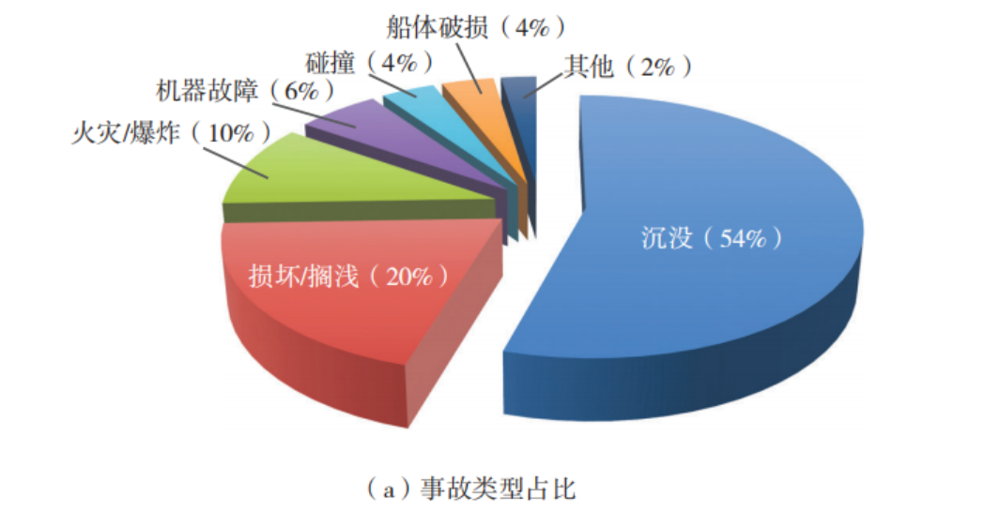
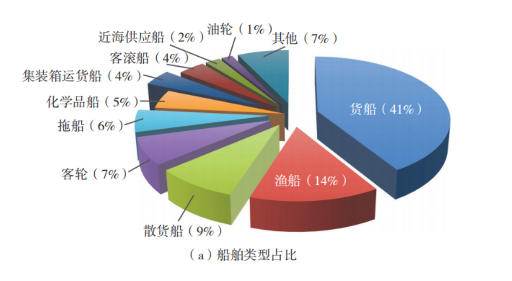

## **大创项目-文档**

1.项目背景

#### 1. **事故发生的环境因素**

- **气象条件**：考虑风速、风向、海浪高度、海流速度等气象因素对船舶运动和操作的影响。
- **海洋环境**：包括水深、海底地形、潮汐、海流等对船舶航行的影响。
- **能见度**：雾、雨、雪等天气条件对船舶导航和避碰的影响。

#### 2. **船舶特性**

- **船舶类型**：不同类型的船舶（如货船、油轮、客船、渔船等）在事故中的表现和应对措施不同。
- **船舶尺寸和重量**：船舶的尺寸、重量、吃水深度等对船舶的操纵性和稳定性有重要影响。
- **船舶设备**：导航设备（如雷达、GPS、AIS）、通信设备、推进系统、锚泊设备等的状态和性能。

#### 3. **人为因素**

- **船员素质**：船员的技能水平、经验、疲劳程度、健康状况等对事故的发生和应对有直接影响。
- **决策过程**：船员在紧急情况下的决策过程、沟通方式、应急预案的执行情况。
- **培训和演练**：船员是否接受过适当的培训和应急演练，以及这些培训和演练的有效性。

#### 4. **管理因素**

- **船舶管理**：船舶的维护保养、设备检查、航行计划、航线选择等管理措施的有效性。
- **公司政策**：航运公司的安全管理体系、风险评估、应急响应计划等。
- **监管和合规**：船舶是否遵守国际海事组织（IMO）和各国海事管理机构的规定和标准。

#### 5. **事故类型和阶段**

- **事故类型**：碰撞、搁浅、火灾、爆炸、沉没等不同类型的事故有不同的动态特征和应对措施。
- **事故阶段**：事故的发生、发展、应急响应、恢复等不同阶段需要不同的建模方法和数据支持。

#### 6. **应急响应和救援**

- **应急预案**：船舶和港口的应急预案、救援资源的配置和调度。
- **救援行动**：救援船只、直升机、潜水员等救援力量的响应时间和行动效果。
- **事故后果**：事故对人员、环境、财产的影响，以及后续的清理和恢复工作。

#### 7. **数据和模型**

- **数据来源**：历史事故数据、船舶航行数据、气象数据、海洋环境数据等。
- **模型选择**：根据事故类型和研究目的选择合适的数学模型（如动力学模型、概率模型、仿真模型等）。
- **模型验证**：通过实际事故数据验证模型的准确性和可靠性。

#### 8. **风险评估和预防**

- **风险识别**：识别可能导致事故的风险因素，如设备故障、人为失误、环境变化等。
- **风险评估**：评估不同风险因素的潜在影响和发生概率。
- **预防措施**：制定和实施预防措施，降低事故发生的可能性。

## 2.设计思路

在考虑到资金，人力和时间的情况下，我们综合抉择，对项目的难度内容进行了一部分的取舍；

#### 1. **明确项目目标和范围**

- **核心目标**：确定项目最核心的目标是什么，哪些功能或成果是必须实现的。
- **最小可行产品（MVP）**：专注于开发一个最小可行产品，即能够展示核心功能的最简化版本。

#### 2. **资源分配**

- **预算分配**：将5000元预算合理分配到最关键的环节，如市场调研、原型开发、宣传推广等。
- **时间管理**：制定详细的时间计划，确保每个阶段都有明确的时间节点和产出。

#### 3. **技术选择**

- **低成本技术**：选择低成本或免费的技术工具和平台，如开源软件、免费云服务等。
- **外包与合作**：对于一些技术难度较高的部分，可以考虑外包或与其他团队合作，以降低成本和风险。

#### 4. **市场调研与用户反馈**

- **市场调研**：利用低成本的市场调研方法，如问卷调查、社交媒体分析等，了解目标用户的需求和痛点。
- **用户反馈**：在开发过程中，及时收集用户反馈，调整产品方向和功能。

#### 5. **宣传与推广**

- **社交媒体**：利用免费的社交媒体平台进行宣传和推广，如微信公众号、微博、抖音等。
- **校园合作**：与学校社团、学生组织合作，进行线下推广活动，扩大项目影响力。

#### 6. **团队分工**

- **明确分工**：根据两人的特长和兴趣，明确分工，确保每个人都能发挥最大作用。
- **技能提升**：利用项目时间，提升团队成员的技能，如学习新的编程语言、市场营销技巧等。

#### 7. **风险管理**

- **风险评估**：定期评估项目中的潜在风险，制定应对措施。
- **灵活调整**：根据实际情况，灵活调整项目计划和目标，确保项目能够顺利进行。

#### 8. **成果展示**

- **项目展示**：在项目结束时，准备一个完整的项目展示，包括产品演示、市场调研结果、用户反馈等。
- **文档整理**：整理项目过程中的文档和资料，为未来的项目或进一步发展提供参考。

#### 9. **寻求外部支持**

- **导师指导**：寻求导师或行业专家的指导，获取宝贵的建议和资源。
- **资金支持**：关注各种创新创业大赛和基金，争取获得额外的资金支持。

#### 10. **持续改进**

- **迭代开发**：在项目结束后，根据用户反馈和市场变化，持续改进产品，逐步完善功能。
- **长期规划**：制定长期发展规划，考虑项目的可持续性和扩展性。

### 3.预算分配

- **市场调研**：200元，用于问卷调查、数据购买等。
- **软件工具**：300元，用于购买必要的软件许可证或云服务。
- **宣传推广**：200元，用于社交媒体推广、海报制作等。
- **其他费用**：200元，用于交通、会议、打印等杂项费用。
- **应急储备**：100元，用于应对突发情况。

### 4.MVP设计

#### 1. **产品名称**

- **名称**：航海安全模拟器（Marine Safety Simulator）

#### 2. **核心目标**

- **目标**：开发一个能够模拟和分析航海事故动态的初步模型，展示事故发生的可能性和影响。
- **MVP功能**：
  - 模拟特定航行条件下的航海事故。
  - 展示事故发生的可能性和影响。
  - 提供简单的用户界面，便于用户输入参数和查看结果。

#### 3. **技术选择**

- **编程语言**：Python（免费且功能强大）
- **数据处理库**：Pandas、NumPy（免费）
- **机器学习库**：Scikit-learn（免费）
- **可视化库**：Matplotlib、Seaborn（免费）
- **用户界面**：Streamlit（免费，用于快速构建Web应用）

#### 4. **数据收集与处理**

- **公开数据**：利用公开的航海事故数据集，如国际海事组织（IMO）提供的数据。
- **数据清洗**：对数据进行清洗和预处理，确保数据质量。
- **特征工程**：提取关键特征，如天气条件、船舶类型、航行速度等。

#### 5. **模型设计**

- **简单机器学习模型**：
  - **线性回归**：使用线性回归模型来预测事故发生的可能性。
  - **决策树**：使用决策树模型来分类和预测事故类型。

#### 6. **模型开发与测试**

- **模型开发**：使用Python等编程语言，开发线性回归和决策树模型。
- **模型测试**：对模型进行测试，验证其准确性和可靠性。
- **模型优化**：根据测试结果，对模型进行优化和调整。

#### 7. **用户界面设计**

- **输入参数**：用户可以输入航行条件（如天气、船舶类型、航行速度等）。
- **结果展示**：模型输出事故发生的可能性及影响，并以图表形式展示。
- **简单交互**：用户可以通过界面调整参数，实时查看结果变化。

#### 8. **宣传与推广**

- **社交媒体**：利用免费的社交媒体平台，如微信公众号、微博、抖音等，进行宣传和推广。
- **校园合作**：与学校社团、学生组织合作，进行线下推广活动，扩大项目影响力。
- **项目展示**：在项目结束时，准备一个完整的项目展示，包括产品演示、市场调研结果、用户反馈等。

#### 9. **团队分工**

- **明确分工**：根据两人的特长和兴趣，明确分工，确保每个人都能发挥最大作用。
  - **技术开发**：负责模型设计、开发和测试。
  - **市场调研**：负责市场调研、用户反馈收集和宣传推广。
- **技能提升**：利用项目时间，提升团队成员的技能，如学习新的编程语言、市场营销技巧等。

#### 10. **风险管理**

- **风险评估**：定期评估项目中的潜在风险，制定应对措施。
- **灵活调整**：根据实际情况，灵活调整项目计划和目标，确保项目能够顺利进行。

#### 11. **成果展示**

- **项目展示**：在项目结束时，准备一个完整的项目展示，包括产品演示、市场调研结果、用户反馈等。
- **文档整理**：整理项目过程中的文档和资料，为未来的项目或进一步发展提供参考。

#### 12. **寻求外部支持**

- **导师指导**：寻求导师或行业专家的指导，获取宝贵的建议和资源。
- **资金支持**：关注各种创新创业大赛和基金，争取获得额外的资金支持。

#### 13. **持续改进**

- **迭代开发**：在项目结束后，根据用户反馈和市场变化，持续改进产品，逐步完善功能。
- **长期规划**：制定长期发展规划，考虑项目的可持续性和扩展性。

#### 具体实施步骤

##### 第1-2个月：市场调研和需求分析

- **问卷调查**：设计并分发问卷，收集目标用户的需求和痛点。
- **社交媒体分析**：利用社交媒体平台，分析相关话题和用户反馈。
- **用户访谈**：通过线上或线下方式，与潜在用户进行访谈，获取深入反馈。

##### 第3-4个月：数据收集与处理

- **数据收集**：收集公开的航海事故数据集。
- **数据清洗**：对数据进行清洗和预处理，确保数据质量。
- **特征工程**：提取关键特征，如天气条件、船舶类型、航行速度等。

##### 第5-7个月：模型设计与开发

- **模型设计**：设计线性回归和决策树模型。
- **模型开发**：使用Python等编程语言，开发模型。
- **模型测试**：对模型进行测试，验证其准确性和可靠性。

##### 第8-9个月：模型优化与用户界面开发

- **模型优化**：根据测试结果，对模型进行优化和调整。
- **用户界面开发**：使用Streamlit开发简单的Web界面，用户可以输入参数并查看结果。

##### 第10-11个月：宣传推广和用户反馈收集

- **宣传推广**：利用免费的社交媒体平台，进行宣传和推广。
- **用户反馈**：收集用户反馈，了解用户对模型的使用体验和改进建议。

##### 第12个月：项目总结和成果展示

- **项目总结**：总结项目过程中的经验和教训，整理项目文档和资料。
- **成果展示**：准备一个完整的项目展示，包括产品演示、市场调研结果、用户反馈等。

尝试用python项目去解决，轻量级处理办法

为什么一定要做渲染，成本太高了

很有可能直接亏本，而且需要时间，所以我们决定从算法角度去实现

做AI甚至都简单些，后面就改名字了，可以直接地优化并实现相关内容

前端--一个网页，可以可视化分析，模拟碰撞，路径规划测试，相关报道

模拟的主题有：

后端--运行服务器，用户注册系统，收费系统，API调用费用，服务器费用等

自动化路径控制算法

相关调研---

