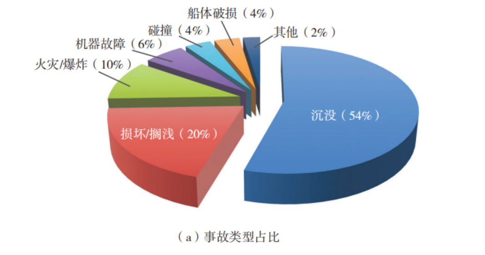
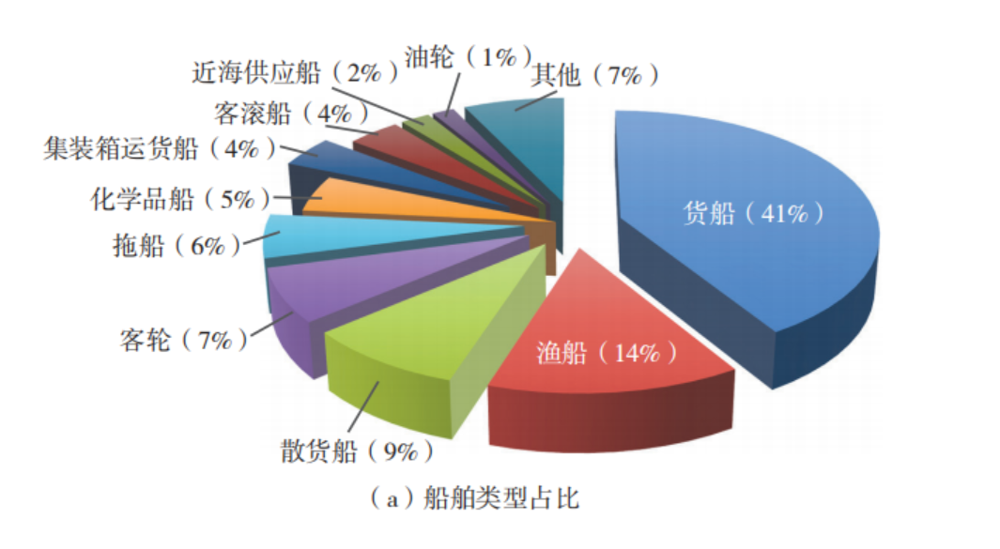
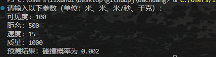

pip install streamlit pandas numpy matplotlib plotly

streamlit run app.py

// 绝对路径
streamlit run c:/Users/18241/Desktop/myproject/front/app.py

-i https://pypi.tuna.tsinghua.edu.cn/simple

URL:
            You can now view your Streamlit app in your browser.

            Local URL: http://localhost:8501
            Network URL: http://192.168.18.193:8501

streamlit sharing: 
    https://share.streamlit.io/

pip install pipreqs
pipreqs .

url: 
    https://dachuang2025shanxi.streamlit.app

AI图片生成：
    https://www.canva.cn/image-generator/?utm_medium=paid&utm_source=baidu&utm_campaign=ACQ-magic-tti&utm_term=aitupianshengchengmianfei&utm_content=sem&bd_vid=12592528579345434432

github仓库
    https://github.com/l1x2h3/dachuang/tree/main

数据处理阶段：网上搜集与构造数据，其实上千1000个构造就没事了
1.需要如下数据集：船只的结构点阵图 --- 只是为了画图，让UI界面更好看
2.故障参数数据，是否发生事故
3.船只运行实际情况图，抓取真是数据（看看网上有没有现成的），只能让AI工具不断改，模拟多对象情况下发生碰撞的情况；

方法1： 合成数据，用AI给出python代码生成随机数或者符合特定分布
方法2：真实数据，但是我们这个小项目成本太高，除非想去发论文？

tips： 可以尝试python脚本写爬虫

要求： 写清楚数据单位，类型，name，抓之前最好和我们模型保持一致
数据存放到data文件夹里面，到时候要写脚本跑模型的

1.船体建模数据：
https://patents.google.com/patent/CN105447909A/zh
https://www.marinetraffic.com/en/ais/home/shipid:5419524/zoom:10

感觉目前找不到合适的数据，这里选择合成数据：

下面是关于碰撞的重新建模：

这里的感知距离和天气有关，请你根据参考文献重新做判断选择，同时给他其他数据的参考文献来源，最后判断标准改成从俯视图角度，在一个船的俯视图中随机多次采样，如果点在另一个图形范围内，则证明发生了碰撞

根据天气给出了概率系数，分类反馈
传入的数据作为多边形来处理，调整接口即可；现在应该封装的比较完善了；

参考文献：
1.感知距离与天气的关系：文献来源：《Marine Navigation and Safety of Sea Transportation》（2013），第 4 章，第 123-135 页。
内容：讨论了能见度对船舶感知距离的影响，提供了不同天气条件下的感知距离因子。

2.航线规划误差：文献来源：《Maritime Navigation and Safety of Sea Transportation》（2015），第 6 章，第 189-201 页。
内容：讨论了航线规划误差的来源和影响，提供了误差范围的参考值。

3.注意力反应时间：文献来源：《Human Factors in Maritime Safety》（2017），第 3 章，第 78-92 页。
内容：讨论了船员注意力反应时间的测量和影响因素，提供了反应时间的参考值。

4.动态物体距离发生碰撞判断：文献来源：《Maritime Safety and Security》（2019），第 5 章，第 145-158 页。
内容：讨论了动态物体距离发生碰撞判断的方法和模型，提供了距离和速度的参考值。

需要修复主页面图片无法加载的问题

注意这里文件目录的结构理解，是从这个项目的根目录开始查找的

这样搭建的一个框架就已经完成了，但是因为数据是合成的，导致最终的结果很差，所以需要重新训练

